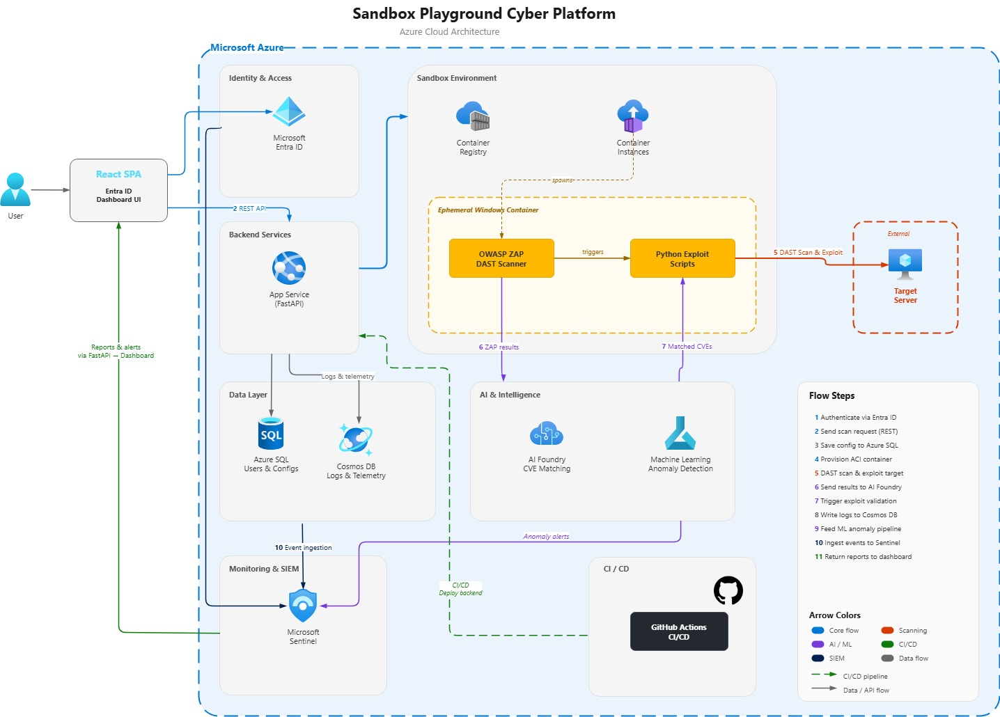

# Sandbox Playground Cyber Platform

A cloud-native, AI-driven cybersecurity platform for automated penetration testing, built on Microsoft Azure.



## Overview

The Sandbox Playground Cyber Platform enables registered users to define target servers and orchestrate automated penetration testing through an intuitive web interface. The system dynamically provisions ephemeral Windows containers for scanning, leverages Azure AI Foundry for intelligent vulnerability matching, and employs Azure Machine Learning for anomaly detection.

> **Academic Project** — Developed as part of bachelor's studies at HIT (Holon Institute of Technology).

## Architecture

```
┌─────────────┐     ┌──────────────┐     ┌─────────────────────────┐
│  React SPA  │────▶│  FastAPI     │────▶│  Azure Container        │
│  (Entra ID) │◀────│  Backend     │◀────│  Instances (ACI)        │
└─────────────┘     └──────┬───────┘     │  ┌───────┐ ┌─────────┐ │
                           │             │  │OWASP  │ │ Exploit │ │
                    ┌──────┴───────┐     │  │ ZAP   │ │ Scripts │ │
                    │  Azure SQL   │     │  └───────┘ └─────────┘ │
                    │  (Users &    │     └─────────────────────────┘
                    │   Configs)   │                │
                    └──────────────┘                ▼
                                        ┌─────────────────────┐
                    ┌───────────────┐   │  Azure AI Foundry   │
                    │  Cosmos DB    │◀──│  (CVE Matching)     │
                    │  (Logs &      │   └─────────────────────┘
                    │   Telemetry)  │
                    └───────┬───────┘   ┌─────────────────────┐
                            │           │  Azure ML           │
                            └──────────▶│  (Anomaly Detection)│
                                        └─────────────────────┘
                    ┌───────────────┐
                    │  Microsoft    │◀── Cosmos DB + Entra ID logs
                    │  Sentinel     │
                    └───────────────┘
```

## How It Works

1. **Authenticate** — Log in via Microsoft Entra ID
2. **Configure** — Define target IP/domain and scan parameters
3. **Scan** — FastAPI provisions an ephemeral ACI container with OWASP ZAP
4. **Analyze** — ZAP results are sent to Azure AI Foundry for CVE template matching
5. **Exploit** — Matched vulnerabilities are validated with custom Python payloads
6. **Report** — Logs flow to Cosmos DB; Azure ML detects anomalies; Sentinel provides SIEM

Containers are destroyed immediately after each scan to minimize compute costs.

## Tech Stack

| Layer | Technology |
|-------|-----------|
| Frontend | React, SAML, Microsoft Entra ID |
| Backend | Python, FastAPI, SQLAlchemy |
| Scanning | OWASP ZAP, Custom Python exploits |
| Containers | Azure Container Instances, Azure Container Registry |
| AI/ML | Azure AI Foundry (LLM), Azure Machine Learning (Scikit-Learn/PyTorch) |
| Databases | Azure SQL (Serverless), Azure Cosmos DB (Serverless) |
| Monitoring | Microsoft Sentinel (KQL) |
| CI/CD | GitHub Actions |

## Project Structure

```
cyber-sandbox-hit/
├── frontend/              # React SPA
├── backend/               # FastAPI application
├── scanner/               # OWASP ZAP container + exploit scripts
├── ml/                    # Azure ML anomaly detection pipeline
├── infra/                 # Azure infrastructure (ARM/Bicep)
└── .github/workflows/     # GitHub Actions CI/CD
```

## Getting Started

### Prerequisites

- Python 3.11+
- Node.js 18+
- Azure subscription with the following services enabled:
  - Azure Container Instances & Container Registry
  - Azure SQL Database (Serverless)
  - Azure Cosmos DB (Serverless)
  - Azure AI Foundry
  - Azure Machine Learning
  - Microsoft Sentinel
  - Microsoft Entra ID (App Registration)

### Setup

```bash
# Clone the repository
git clone https://github.com/<org>/cyber-sandbox-hit.git
cd cyber-sandbox-hit

# Backend
cd backend
python -m venv venv
source venv/bin/activate  # or venv\Scripts\activate on Windows
pip install -r requirements.txt
uvicorn app.main:app --reload

# Frontend
cd ../frontend
npm install
npm start
```

### Environment Variables

Configure the following (use Azure Key Vault in production):

```
AZURE_SQL_CONNECTION_STRING=
AZURE_COSMOS_ENDPOINT=
AZURE_COSMOS_KEY=
AZURE_ACR_LOGIN_SERVER=
AZURE_AI_FOUNDRY_ENDPOINT=
AZURE_AI_FOUNDRY_KEY=
AZURE_SUBSCRIPTION_ID=
AZURE_RESOURCE_GROUP=
ENTRA_CLIENT_ID=
ENTRA_TENANT_ID=
```

## CI/CD

GitHub Actions automatically:
1. Build and test the FastAPI backend
2. Build the scanner Docker image
3. Push the image to Azure Container Registry
4. Deploy the backend to Azure App Service

## Ethical Use

This platform is designed for **authorized security testing only**. All scan targets must be explicitly approved. Unauthorized use against systems you do not own or have permission to test is prohibited.

## Team

Developed by students at HIT (Holon Institute of Technology) as a bachelor's degree project.

## License

This project is for academic purposes.
