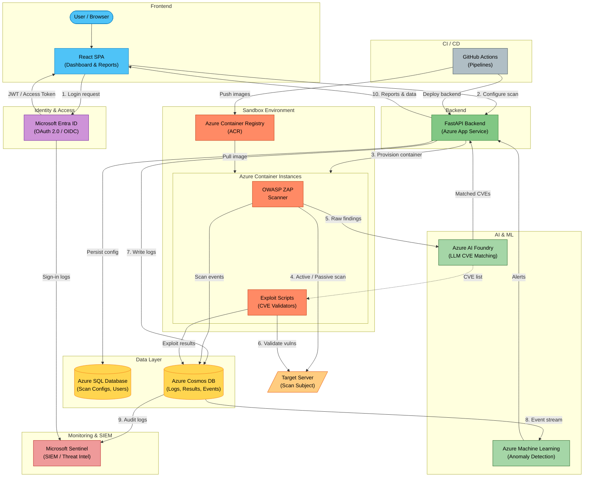
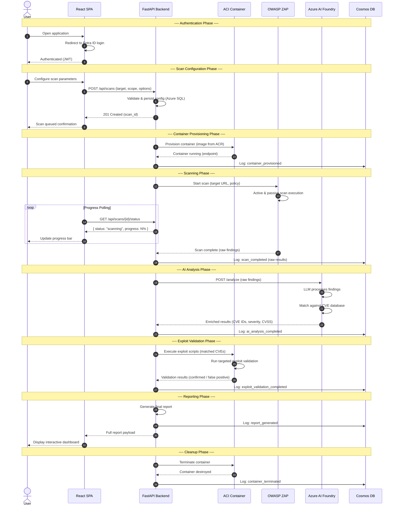

# Sandbox Playground Cyber Platform - Architecture

## System Architecture

### Flow Legend

| Step | Flow | Description |
|------|------|-------------|
| 1 | User --> Entra ID --> React | User authenticates via Microsoft Entra ID (OAuth 2.0 / OIDC) |
| 2 | React --> FastAPI --> Azure SQL | User configures a penetration test scan; config is persisted |
| 3 | FastAPI --> ACI (pulls from ACR) | Backend provisions an isolated container instance for the scan |
| 4 | ZAP --> Target Server | OWASP ZAP performs active and passive scanning against the target |
| 5 | ZAP --> AI Foundry --> FastAPI | Raw scan findings are sent to Azure AI Foundry for LLM-based CVE matching |
| 6 | Exploit Scripts --> Target Server | Exploit scripts validate discovered vulnerabilities against the target |
| 7 | All components --> Cosmos DB | Scan events, exploit results, and API logs are written to Cosmos DB |
| 8 | Cosmos DB --> Azure ML | Event streams feed anomaly detection models in Azure Machine Learning |
| 9 | Cosmos DB + Entra ID --> Sentinel | Audit logs and sign-in events are ingested by Microsoft Sentinel (SIEM) |
| 10 | FastAPI --> React | Aggregated reports and dashboards are served back to the user |

---

## Scan Lifecycle - Sequence Diagram

### Sequence Diagram Notes

- **Authentication** uses Microsoft Entra ID with OAuth 2.0 authorization code flow. The React SPA receives a JWT that is attached to every subsequent API call.
- **Container isolation** ensures each scan runs in a dedicated Azure Container Instance, preventing cross-scan interference and providing a clean environment.
- **Progress polling** keeps the user informed. A future enhancement could replace polling with WebSocket-based real-time updates.
- **AI analysis** leverages a large language model hosted in Azure AI Foundry to correlate raw scanner output with known CVEs, reducing manual triage effort.
- **Exploit validation** acts as a confirmation step -- only vulnerabilities that can be actively demonstrated are flagged as "confirmed," reducing false positive noise.
- **Cleanup** is automatic: containers are terminated and deallocated once the scan lifecycle completes, keeping infrastructure costs predictable.
