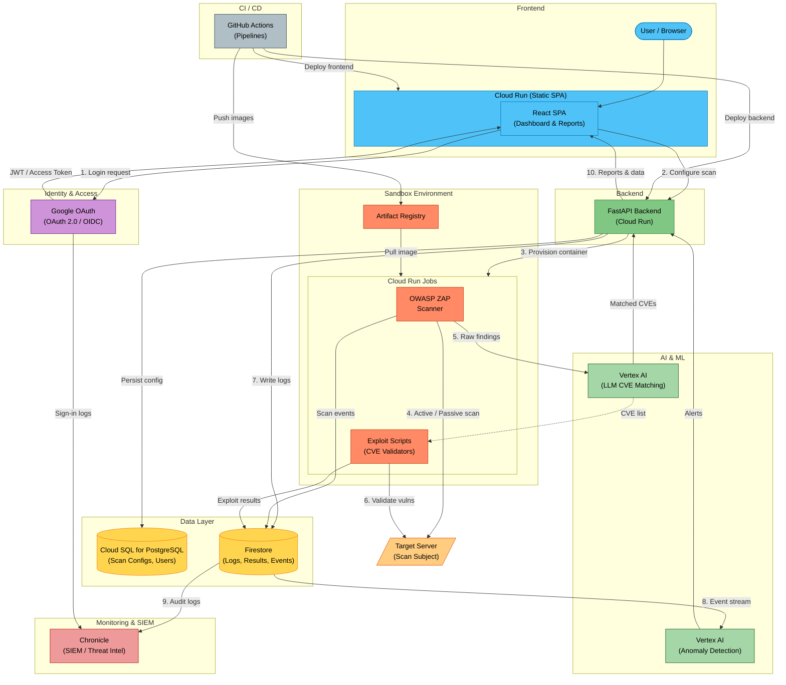
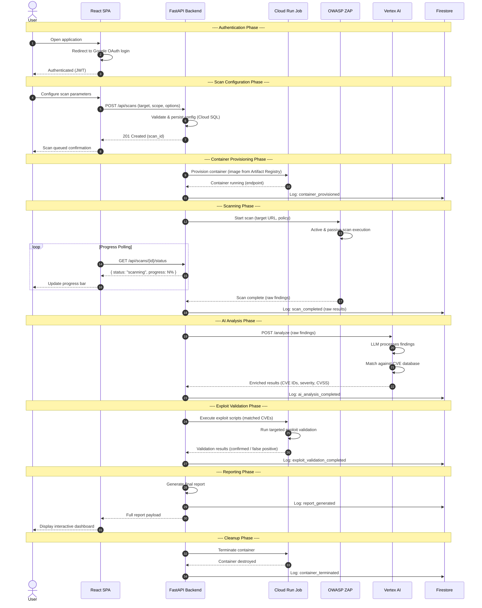

# Sandbox Playground Cyber Platform - Architecture

## System Architecture

```mermaid
flowchart TB
    %% ───────────────────────────────────────────────
    %% FRONTEND
    %% ───────────────────────────────────────────────
    subgraph FRONTEND["Frontend"]
        direction TB
        USER(["User / Browser"])
        subgraph HOSTING["Cloud Run (Static SPA)"]
            REACT["React SPA<br/>(Dashboard & Reports)"]
        end
        USER --> REACT
    end

    %% ───────────────────────────────────────────────
    %% IDENTITY
    %% ───────────────────────────────────────────────
    subgraph IDENTITY["Identity & Access"]
        GAUTH["Google OAuth<br/>(OAuth 2.0 / OIDC)"]
    end

    %% ───────────────────────────────────────────────
    %% BACKEND
    %% ───────────────────────────────────────────────
    subgraph BACKEND["Backend"]
        FASTAPI["FastAPI Backend<br/>(Cloud Run)"]
    end

    %% ───────────────────────────────────────────────
    %% DATA
    %% ───────────────────────────────────────────────
    subgraph DATA["Data Layer"]
        SQLDB[("Cloud SQL for PostgreSQL<br/>(Scan Configs, Users)")]
        FIRESTORE[("Firestore<br/>(Logs, Results, Events)")]
    end

    %% ───────────────────────────────────────────────
    %% SANDBOX
    %% ───────────────────────────────────────────────
    subgraph SANDBOX["Sandbox Environment"]
        REGISTRY["Artifact Registry"]
        subgraph RUNJOB["Cloud Run Jobs"]
            ZAP["OWASP ZAP<br/>Scanner"]
            EXPLOIT["Exploit Scripts<br/>(CVE Validators)"]
        end
    end

    %% ───────────────────────────────────────────────
    %% TARGET
    %% ───────────────────────────────────────────────
    TARGET[/"Target Server<br/>(Scan Subject)"/]

    %% ───────────────────────────────────────────────
    %% AI / ML
    %% ───────────────────────────────────────────────
    subgraph AIML["AI & ML"]
        VERTEXLLM["Vertex AI<br/>(LLM CVE Matching)"]
        VERTEXML["Vertex AI<br/>(Anomaly Detection)"]
    end

    %% ───────────────────────────────────────────────
    %% MONITORING
    %% ───────────────────────────────────────────────
    subgraph MONITORING["Monitoring & SIEM"]
        CHRONICLE["Chronicle<br/>(SIEM / Threat Intel)"]
    end

    %% ───────────────────────────────────────────────
    %% CI/CD
    %% ───────────────────────────────────────────────
    subgraph CICD["CI / CD"]
        DEVOPS["GitHub Actions<br/>(Pipelines)"]
    end

    %% ═══════════════════════════════════════════════
    %% FLOWS
    %% ═══════════════════════════════════════════════

    %% 1 - Authentication
    REACT -- "1. Login request" --> GAUTH
    GAUTH -- "JWT / Access Token" --> REACT

    %% 2 - Scan configuration
    REACT -- "2. Configure scan" --> FASTAPI
    FASTAPI -- "Persist config" --> SQLDB

    %% 3 - Container provisioning
    FASTAPI -- "3. Provision container" --> RUNJOB
    REGISTRY -- "Pull image" --> RUNJOB

    %% 4 - Scanning target
    ZAP -- "4. Active / Passive scan" --> TARGET
    EXPLOIT -- "6. Validate vulns" --> TARGET

    %% 5 - AI CVE matching
    ZAP -- "5. Raw findings" --> VERTEXLLM
    VERTEXLLM -- "Matched CVEs" --> FASTAPI

    %% 6 - Exploit validation (uses CVE results)
    VERTEXLLM -. "CVE list" .-> EXPLOIT

    %% 7 - Logging
    FASTAPI -- "7. Write logs" --> FIRESTORE
    ZAP -- "Scan events" --> FIRESTORE
    EXPLOIT -- "Exploit results" --> FIRESTORE

    %% 8 - Anomaly detection
    FIRESTORE -- "8. Event stream" --> VERTEXML
    VERTEXML -- "Alerts" --> FASTAPI

    %% 9 - SIEM integration
    FIRESTORE -- "9. Audit logs" --> CHRONICLE
    GAUTH -- "Sign-in logs" --> CHRONICLE

    %% 10 - Reporting
    FASTAPI -- "10. Reports & data" --> REACT

    %% CI/CD deployments
    DEVOPS -- "Deploy backend" --> FASTAPI
    DEVOPS -- "Deploy frontend" --> HOSTING
    DEVOPS -- "Push images" --> REGISTRY

    %% ═══════════════════════════════════════════════
    %% STYLES
    %% ═══════════════════════════════════════════════
    classDef frontendStyle fill:#4FC3F7,stroke:#0277BD,color:#000
    classDef identityStyle fill:#CE93D8,stroke:#6A1B9A,color:#000
    classDef backendStyle fill:#81C784,stroke:#2E7D32,color:#000
    classDef dataStyle fill:#FFD54F,stroke:#F57F17,color:#000
    classDef sandboxStyle fill:#FF8A65,stroke:#BF360C,color:#000
    classDef aiStyle fill:#A5D6A7,stroke:#1B5E20,color:#000
    classDef monitorStyle fill:#EF9A9A,stroke:#B71C1C,color:#000
    classDef cicdStyle fill:#B0BEC5,stroke:#37474F,color:#000
    classDef targetStyle fill:#FFCC80,stroke:#E65100,color:#000

    class USER,REACT,HOSTING frontendStyle
    class GAUTH identityStyle
    class FASTAPI backendStyle
    class SQLDB,FIRESTORE dataStyle
    class REGISTRY,ZAP,EXPLOIT sandboxStyle
    class VERTEXLLM,VERTEXML aiStyle
    class CHRONICLE monitorStyle
    class DEVOPS cicdStyle
    class TARGET targetStyle
```

### Flow Legend

| Step | Flow | Description |
|------|------|-------------|
| 1 | User --> Google OAuth --> React | User authenticates via Google OAuth (OAuth 2.0 / OIDC) |
| 2 | React --> FastAPI --> Cloud SQL | User configures a penetration test scan; config is persisted |
| 3 | FastAPI --> Cloud Run Job (pulls from Artifact Registry) | Backend provisions an isolated container instance for the scan |
| 4 | ZAP --> Target Server | OWASP ZAP performs active and passive scanning against the target |
| 5 | ZAP --> Vertex AI --> FastAPI | Raw scan findings are sent to Vertex AI for LLM-based CVE matching |
| 6 | Exploit Scripts --> Target Server | Exploit scripts validate discovered vulnerabilities against the target |
| 7 | All components --> Firestore | Scan events, exploit results, and API logs are written to Firestore |
| 8 | Firestore --> Vertex AI | Event streams feed anomaly detection models in Vertex AI |
| 9 | Firestore + Cloud Identity --> Chronicle | Audit logs and sign-in events are ingested by Chronicle (SIEM) |
| 10 | FastAPI --> React | Aggregated reports and dashboards are served back to the user |

---

## Scan Lifecycle - Sequence Diagram

```mermaid
sequenceDiagram
    autonumber

    actor User
    participant React as React SPA
    participant FastAPI as FastAPI Backend
    participant Run as Cloud Run Job
    participant ZAP as OWASP ZAP
    participant AI as Vertex AI
    participant Firestore as Firestore

    Note over User,Firestore: ---- Authentication Phase ----
    User->>React: Open application
    React->>React: Redirect to Google OAuth login
    React-->>User: Authenticated (JWT)

    Note over User,Firestore: ---- Scan Configuration Phase ----
    User->>React: Configure scan parameters
    React->>FastAPI: POST /api/scans (target, scope, options)
    FastAPI->>FastAPI: Validate & persist config (Cloud SQL)
    FastAPI-->>React: 201 Created (scan_id)
    React-->>User: Scan queued confirmation

    Note over User,Firestore: ---- Container Provisioning Phase ----
    FastAPI->>Run: Provision container (image from Artifact Registry)
    Run-->>FastAPI: Container running (endpoint)
    FastAPI->>Firestore: Log: container_provisioned

    Note over User,Firestore: ---- Scanning Phase ----
    FastAPI->>ZAP: Start scan (target URL, policy)
    ZAP->>ZAP: Active & passive scan execution

    loop Progress Polling
        React->>FastAPI: GET /api/scans/{id}/status
        FastAPI-->>React: { status: "scanning", progress: N% }
        React-->>User: Update progress bar
    end

    ZAP-->>FastAPI: Scan complete (raw findings)
    FastAPI->>Firestore: Log: scan_completed (raw results)

    Note over User,Firestore: ---- AI Analysis Phase ----
    FastAPI->>AI: POST /analyze (raw findings)
    AI->>AI: LLM processes findings
    AI->>AI: Match against CVE database
    AI-->>FastAPI: Enriched results (CVE IDs, severity, CVSS)
    FastAPI->>Firestore: Log: ai_analysis_completed

    Note over User,Firestore: ---- Exploit Validation Phase ----
    FastAPI->>Run: Execute exploit scripts (matched CVEs)
    Run->>Run: Run targeted exploit validation
    Run-->>FastAPI: Validation results (confirmed / false positive)
    FastAPI->>Firestore: Log: exploit_validation_completed

    Note over User,Firestore: ---- Reporting Phase ----
    FastAPI->>FastAPI: Generate final report
    FastAPI->>Firestore: Log: report_generated
    FastAPI-->>React: Full report payload
    React-->>User: Display interactive dashboard

    Note over User,Firestore: ---- Cleanup Phase ----
    FastAPI->>Run: Terminate container
    Run-->>FastAPI: Container destroyed
    FastAPI->>Firestore: Log: container_terminated
```

### Sequence Diagram Notes

- **Authentication** uses Google OAuth with the OAuth 2.0 authorization code flow. The React SPA receives a token that is attached to every subsequent API call.
- **Container isolation** ensures each scan runs in a dedicated Cloud Run Job, preventing cross-scan interference and providing a clean environment.
- **Progress polling** keeps the user informed. A future enhancement could replace polling with WebSocket-based real-time updates.
- **AI analysis** leverages a large language model hosted in Vertex AI to correlate raw scanner output with known CVEs, reducing manual triage effort.
- **Exploit validation** acts as a confirmation step -- only vulnerabilities that can be actively demonstrated are flagged as "confirmed," reducing false positive noise.
- **Cleanup** is automatic: containers are terminated and deallocated once the scan lifecycle completes, keeping infrastructure costs predictable.
